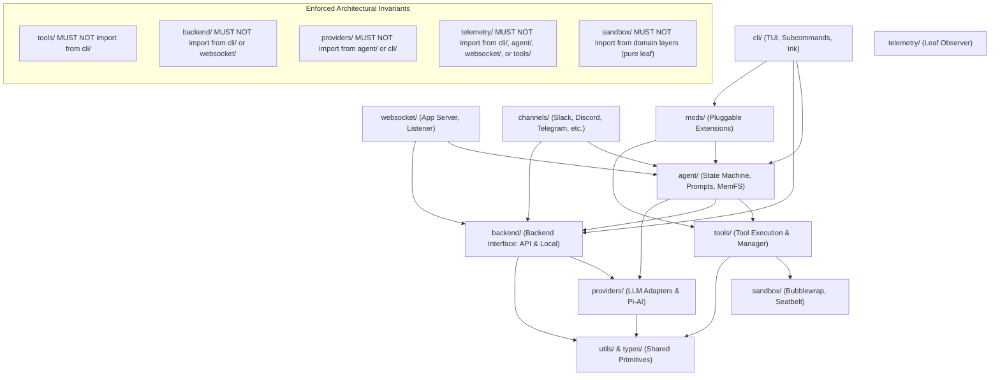
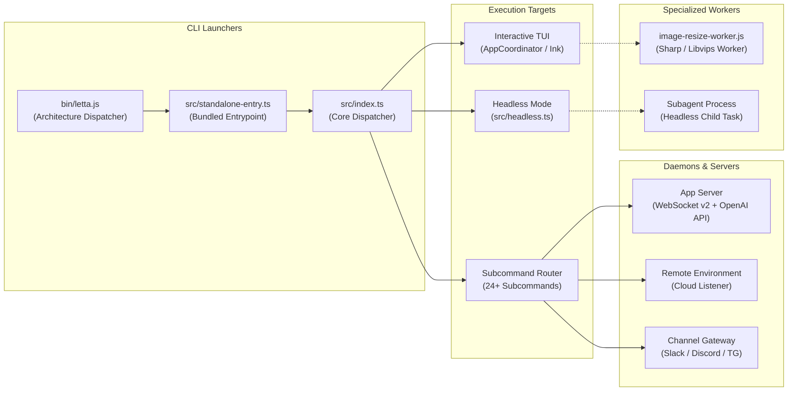
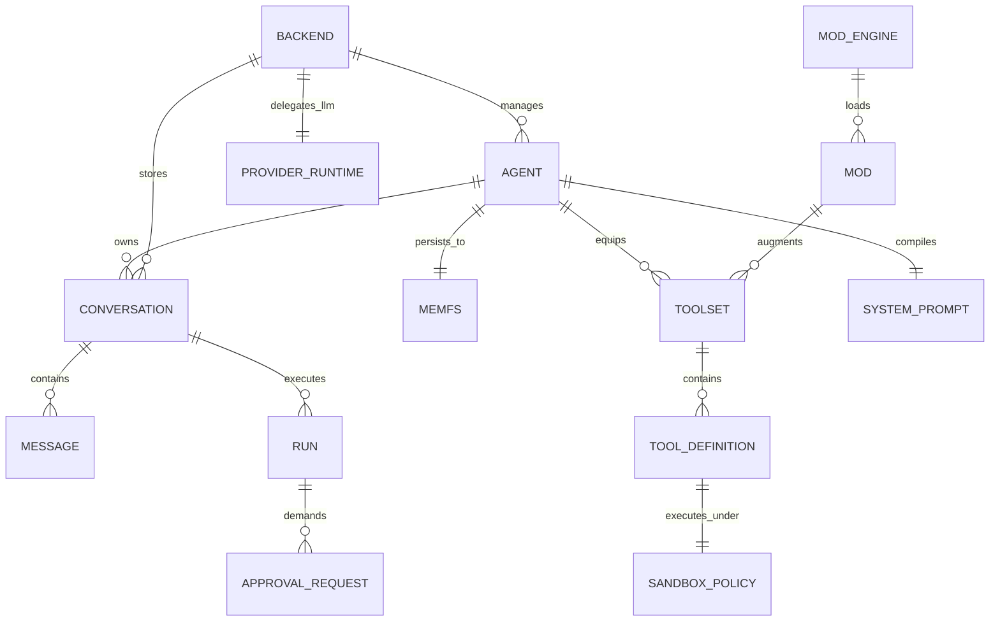
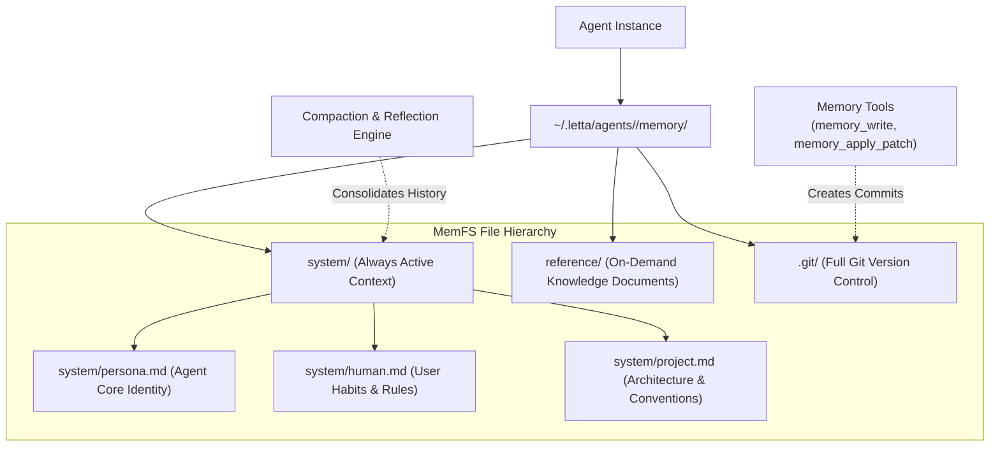
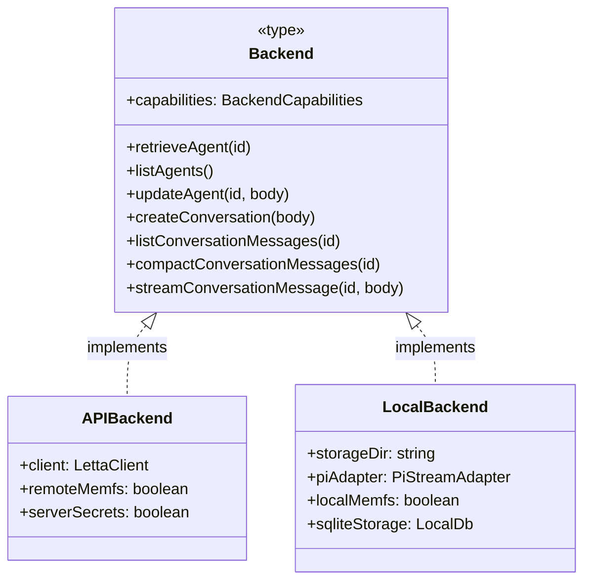

# Architecture Deep-Dive: Letta Code (`@letta-ai/letta-code`)

This document provides a comprehensive architectural analysis of the **Letta Code** codebase (`@letta-ai/letta-code` v0.31.6), a stateful, agentic developer CLI and daemon platform designed by Letta AI.

---

## 1. Directory Structure & Organization Philosophy

Letta Code employs a modular, layer-oriented architecture designed to support both interactive terminal usage (React/Ink TUI) and headless execution (scripts, CI, background subagents, App Server RPC, and multi-channel messaging gateways).

```text
letta-code/
├── bin/                       # Architecture-detecting binary launcher
├── src/                       # Core TypeScript source code
│   ├── agent/                 # Agent state machine, context, prompts, & MemFS
│   ├── auth/                  # OAuth tokens, API keys, & credential storage
│   ├── backend/               # Dual-engine abstraction: API/Cloud vs. Local
│   ├── channels/              # Multi-channel messaging gateway & supervisors
│   ├── cli/                   # React 18 / Ink 5 TUI, components, & commands
│   ├── cron/                  # Cron parsing & task scheduling engine
│   ├── experiments/           # Feature flags & progressive rollouts
│   ├── helpers/               # Shared domain utilities & formatters
│   ├── hooks/                 # Claude Code-compatible lifecycle hooks engine
│   ├── integration-tests/     # End-to-end integration test suites
│   ├── lsp/                   # Language Server Protocol client & managers
│   ├── mods/                  # Pluggable extension & capability engine
│   ├── permissions/           # Granular permission policies & rulesets
│   ├── providers/             # Multi-LLM provider catalog & BYOK adapters
│   ├── queue/                 # Turn & message queue coordinators
│   ├── reminders/             # Interaction reminders & memory sync triggers
│   ├── sandbox/               # Process isolation (Bubblewrap, Seatbelt, Docker)
│   ├── skills/                # Skills discovery, parsing, & execution
│   ├── telemetry/             # Privacy-preserving analytics & crash reporting
│   ├── test-utils/            # Test doubles, mocks, & isolation harnesses
│   ├── tools/                 # Tool definitions, schemas, & implementations
│   ├── types/                 # Shared protocol schemas & wire types
│   ├── updater/               # Self-update mechanisms & version checks
│   ├── utils/                 # Low-level primitives (PTY, timing, processes)
│   ├── web/                   # Web search & browser integration helpers
│   └── websocket/             # Native v2 WebSocket App Server & Remote Listener
├── hooks/                     # Reference / example shell & Python hook scripts
├── scripts/                   # Build tooling, boundary checks, & test runners
├── .skills/                   # Workspace-level repository skills
├── docker/                    # Container environments for sandbox runners
├── docs/                      # Developer guides, modding APIs, & protocol specs
├── assets/                    # Static image & iconography assets
├── build.js                   # Bun multi-target bundling pipeline
└── package.json               # Package manifests, scripts, & export maps
```

### Architectural Layering & Boundary Enforcement

The codebase strictly enforces unidirectional layer dependencies via an automated architectural gate (`scripts/check-layer-boundaries.js`). Cross-boundary violations cause immediate build and CI failures:



### Key Directory Responsibilities

1. **`src/` (Core Application Layer)**:
   - Contains all domain modules, TUI presentation logic, execution backends, and networking protocols.
   - Code is written in strict TypeScript using ESM semantics and `@/*` path aliases.
2. **`bin/` (Binary Dispatcher)**:
   - Houses `bin/letta.js`, an environment-agnostic launcher running on Node or Bun.
   - Dynamically inspects `process.platform` and `process.arch` to locate and execute precompiled native platform binaries (`letta-macos-arm64`, `letta-linux-x64`, etc.).
3. **`hooks/` (Example Lifecycle Hooks)**:
   - Ships production-grade reference hooks demonstrating how users can extend the CLI lifecycle without modifying core code.
   - Examples include destructive command prevention (`block-rm-rf.sh`), automated formatting (`fix-on-changes.sh`), typechecking triggers (`typecheck-on-changes.sh`), system notifications (`desktop-notification.sh`), and Python-based memory telemetry (`memory_logger.py`).
4. **`scripts/` (Engineering & Quality Infrastructure)**:
   - Houses deterministic verification scripts that preserve codebase hygiene:
     - `check-layer-boundaries.js`: Parses AST/imports using Glob to prevent architecture leaks.
     - `check-module-ownership.js`: Prevents module re-export antipatterns and enforces encapsulation.
     - `check:cycles`: Invokes `madge` to guarantee an acyclic module dependency graph.
     - `check-source-file-size.js`: Enforces modularity budgets against a tracked baseline (`source-file-size-baseline.json`).
     - `check-test-mock-isolation.js`: Detects leaking test doubles across suite runs.
     - `postinstall-patches.js`: Patches native binary permissions (such as `node-pty` spawn helpers).
5. **`.skills/` vs `src/skills/builtin/` (Agent Capability Distribution)**:
   - `src/skills/builtin/`: 23 core skills bundled directly with the application (e.g. `acquiring-skills`, `initializing-memory`, `syncing-memory-filesystem`, `dispatching-coding-agents`, `context-doctor`). During build, `build.js` copies these to `skills/` in the package root.
   - `.skills/`: Workspace-local skills loaded dynamically at runtime (e.g. `adding-models`, `capturing-tui-visual-proof`).

---

## 2. System Entry Points

Letta Code provides three distinct categories of entry points: CLI launchers, server/daemon runtimes, and specialized worker processes.



### 1. CLI Entry Points

- **`bin/letta.js` (Architecture Dispatcher)**:
  - Uses `#!/usr/bin/env node` for broad package manager compatibility.
  - Maps OS (`linux`, `darwin`, `win32`) and CPU architecture (`arm64`, `x64`) to the corresponding native compiled binary.
  - Spawns the binary with inherited stdio and forwards OS signals (`SIGINT`, `SIGTERM`).
- **`src/standalone-entry.ts` (Application Bootstrap)**:
  - Invoked when running the bundled JavaScript artifact (`letta.js`).
  - Pre-registers OAuth loaders via `@earendil-works/pi-ai/bun-oauth` to ensure bundler-opaque providers operate seamlessly before domain logic loads.
  - Asynchronously imports `src/index.ts`.
- **`src/index.ts` (Master CLI Controller)**:
  - Parses command-line flags and environment variables via `src/cli/args.ts`.
  - Determines startup mode:
    - **Interactive TUI**: When stdin is a TTY and no headless flags (`-p`, `--prompt`, `--run`) are present, initializes the React 18 / Ink 5 TUI application (`src/cli/App.tsx`).
    - **Headless Mode (`src/headless.ts`)**: Triggered when stdin is piped or explicit prompt/run flags are supplied. Executes prompt turns directly to stdout without terminal animations.
    - **Subcommands Router (`src/cli/subcommands/router.ts`)**: Routes execution to 24+ domain commands:
      - `agents`: List, inspect, and delete agent instances.
      - `server`: Launch App Server or Remote Listener.
      - `channels`: Manage and inspect external communication channels.
      - `channel-gateway`: Launch the long-running messaging gateway.
      - `cron`: Inspect and trigger scheduled tasks.
      - `memory` (alias `memfs`): Inspect or sync agent memory trees.
      - `mods`: Scaffold, install, or inspect pluggable extensions.
      - `sandbox`: Validate container and process isolation runners.
      - `skills`: Search, install, and create reusable skills.
      - `teleport`: Export or migrate agent states across environments.
      - `update` (alias `upgrade`): Self-update the CLI to candidate releases.

### 2. Daemon & Server Entry Points

- **App Server (`letta server --listen [url]`)**:
  - Defined in `src/cli/subcommands/app-server.ts` and `src/websocket/app-server.ts`.
  - Binds a high-performance native WebSocket server operating over the Letta v2 frame protocol.
  - Supports capability token validation (`--ws-token-file`, `--ws-token-sha256`) or signed JWT bearer tokens (`--ws-shared-secret-file`, `--ws-issuer`, `--ws-audience`).
  - When `--openai-api` is toggled, mounts an HTTP listener exposing OpenAI-compatible endpoints:
    - `GET /v1/models`: Enumerates active Letta agents as available models.
    - `POST /v1/chat/completions`: Streams LLM inference backed by agent memory.
    - `POST /v1/responses`: Handles asynchronous turn and tool completion hooks.
- **Remote Environment Listener (`letta server` / `letta listen` / `letta remote`)**:
  - Defined in `src/cli/subcommands/listen.tsx` and `src/websocket/listener/`.
  - Connects the local host machine to Letta Cloud via an outbound WebSocket bridge.
  - Exposes local filesystem, shell, and tool capabilities to remote agents in a secure sandbox.
- **Channel Gateway (`letta channel-gateway`)**:
  - Defined in `src/cli/subcommands/channel-gateway.ts` and `src/channels/gateway-core.ts`.
  - Long-running service coordinating messaging integrations (Slack, Telegram, Discord, Signal, WhatsApp).
  - Manages thread-to-conversation mapping, typing indicator timers, rich draft streaming, and authorization pairing.

### 3. Worker Scripts

- **`image-resize-worker.js` (`src/utils/image-resize-worker.ts`)**:
  - Dedicated background worker spawned to handle heavy image manipulation, scaling, and compression via `sharp` (or ImageMagick CLI fallback).
  - Offloads image rendering from the main Node/Bun thread, guaranteeing the terminal UI never drops frames or suffers input lag during visual workflows.
- **Subagent Workers (`src/agent/subagents/`)**:
  - Headless processes spawned by parent agents to execute delegated coding tasks in parallel.
  - Run with isolated git worktrees (`src/tools/impl/enter-worktree.ts`), dedicated environment variables, and strict step budgets (`maxSteps`).

---

## 3. Core Abstractions & Their Relationships

Letta Code's design models an operating system for stateful AI agents:



### 1. Agents & The State Machine

- **`AgentState`**:
  - The canonical data structure representing an agent's persistent identity.
  - Tracks:
    - Unique `id` (e.g. `agent-123...`).
    - Active model configuration (`model`, `provider`, `context_window`, `reasoning_effort`).
    - Tool bindings and client-side skill registrations.
    - System prompt templates and memory block linkages.
- **Personality Presets (`src/agent/personality-presets.ts`)**:
  - Define standard personas (Generalist, Software Engineer, Data Analyst, Tutor, Creative Writer).
  - Pre-configure toolsets, system prompt instructions, and default memory layouts.
- **Approval Engine & Two-Phase Recovery (`src/agent/check-approval.ts`, `approval-recovery.ts`)**:
  - All side-effecting tool actions (file modifications, shell commands, web requests) pass through an explicit approval lifecycle.
  - When an agent proposes a tool call, the runtime creates an `ApprovalRequest`.
  - In interactive mode, the user approves, modifies, or denies the action via TUI modal dialogs.
  - In headless or remote mode, `turn-recovery-policy.ts` and `approval-recovery.ts` reconcile pending approvals across process restarts, ensuring idempotent recovery without orphaned side effects.

### 2. Memory Architecture (MemFS)

Memory in Letta Code is externalized, version-controlled, and file-based, avoiding hidden vector-database black boxes:



- **File-Backed Storage (`src/agent/memory-filesystem.ts`)**:
  - Stored under `~/.letta/agents/<agent-id>/memory/`.
  - Structured into:
    - `system/`: Core working memory. Always injected into the system prompt.
      - `persona.md`: Behavioral rules, pair-programming style, and persona definition.
      - `human.md`: User preferences, communication style, and environment constraints.
      - `project.md`: Codebase architecture, conventions, and dependency rules.
    - `reference/`: Secondary knowledge documents retrieved or searched on demand.
- **Git-Backed Integrity (`src/agent/memory-git.ts`)**:
  - Every MemFS directory is initialized as a dedicated Git repository.
  - Memory modifications made via `memory_write` or `memory_apply_patch` produce discrete Git commits with structured commit messages.
  - Enables snapshotting, rollback of erroneous memory updates, and branch-based isolated subagent exploration.
- **Compaction & Reflection Engine (`src/cli/helpers/memory-reminder.ts`, `src/backend/local-compaction.ts`)**:
  - Monitors token pressure within the LLM context window.
  - When context limits approach threshold boundaries, a reflection turn is triggered to summarize recent decisions and persist durable findings into MemFS before context eviction occurs.

### 3. Tool System & Execution Pipeline

- **Tool Definitions & Schemas (`src/tools/define-tool.ts`, `src/tools/schemas/`)**:
  - Tools declare JSON Schema parameters and model-facing descriptions tailored per LLM provider (Codex, Claude, Gemini).
- **Tool Manager (`src/tools/manager.ts`)**:
  - Central dispatcher that validates inputs, applies permission policies, and handles output truncation.
  - Implements output clamping to prevent token context exhaustion when commands produce massive output.
- **Key Tool Implementations (`src/tools/impl/`)**:
  - **Filesystem Tools**: `read.ts`, `write.ts`, `edit.ts`, `multi-edit.ts`, `apply-patch.ts`.
  - **Shell Execution**: `bash.ts`, `shell-runner.ts`, `exec-command.ts`. Runs commands under PTY control with real-time output streaming.
  - **Git Worktree Isolation**: `enter-worktree.ts`, `exit-worktree.ts`. Spawns isolated Git worktrees for safe, non-destructive experimentation.
  - **Background Tasks**: `task.ts`, `task-create.ts`, `task-stop.ts`. Manages asynchronous long-running jobs with live output buffers.
  - **Memory Operations**: `memory.ts`, `memory-apply-patch.ts`. Interfaces directly with MemFS Git repositories.

### 4. Dual-Backend Architecture

Letta Code abstracts storage and execution behind the polymorphic `Backend` contract (`src/backend/backend.ts`):



1. **Cloud/API Backend (`src/backend/api/`)**:
   - Thin proxy over `@letta-ai/letta-client`.
   - Delegates agent storage, message indexing, and LLM inference to Letta Cloud.
   - Ideal for multi-device synchronization and hosted model execution.
2. **Local Backend (`src/backend/local/local-backend.ts`)**:
   - Embedded, zero-cloud execution engine.
   - Stores agents, conversations, and message history locally using SQLite and file storage.
   - Leverages `@earendil-works/pi-ai` to drive local and BYOK LLMs directly from the user's workstation.
   - Provides 100% offline, privacy-first pair programming.

### 5. Multi-Provider LLM Runtime

- **Unified Streaming Adapter (`src/backend/pi-stream-adapter.ts`)**:
  - Leverages `@earendil-works/pi-ai` to unify streaming protocols across OpenAI, Anthropic, Google Gemini, Ollama, Groq, Mistral, and DeepSeek.
  - Normalizes chunk formats, reasoning token blocks (`<thought>`), tool call deltas, and usage metrics into unified event streams.
- **Model Catalog & Tiering (`src/agent/model.ts`, `model-catalog.ts`)**:
  - Dynamically calculates context window capacities and pricing tiers.
  - Manages reasoning effort settings (`low`, `medium`, `high`, `none`) across providers.
  - Provides ChatGPT plan rotation on quota exhaustion (`src/agent/chatgpt-plan-rotation.ts`).

### 6. Client/Server & Channel Gateways

- **Native v2 WebSocket Protocol (`src/websocket/`)**:
  - Low-latency binary/text framing protocol for real-time terminal streaming and remote tool execution.
  - Includes mutual authentication via shared secret files, capability hashes, and audience checks.
- **Channel Gateway Architecture (`src/channels/`)**:
  - Decouples conversational frontends from core agent logic.
  - Features:
    - **Inbound Debouncing (`inbound-debounce.ts`)**: Batches rapid user messages into coherent turns.
    - **Rich Draft Streaming (`channel-rich-draft-streamer.ts`)**: Live updates draft messages in Slack/Discord as the agent thinks and calls tools.
    - **Access Control & Pairing (`access-control.ts`, `pairing.ts`)**: Restricts agent interaction to authorized user IDs and handles pairing codes.
    - **Audio Transcription (`transcription/`)**: Converts voice messages into text prompts before feeding them into the conversation queue.

### 7. Extensibility: Hooks, Mods, & LSP

- **Lifecycle Hooks (`src/hooks/`)**:
  - Claude Code-compatible event triggers:
    - `PreToolUse`, `PostToolUse`, `PostToolUseFailure`
    - `PermissionRequest`, `UserPromptSubmit`
    - `Stop`, `SubagentStop`, `PreCompact`
    - `SessionStart`, `SessionEnd`
  - Supports both shell command execution and prompt-based LLM evaluators.
- **Pluggable Mod Engine (`src/mods/mod-engine.ts`)**:
  - Allows full programmatic extensions with declared capability sets (custom tools, slash commands, UI panels, event listeners).
- **LSP Client Manager (`src/lsp/manager.ts`)**:
  - Connects to language servers (TypeScript, Python, Rust, Go) to provide symbols, diagnostics, and hover documentation to agent tools.

---

## 4. Dependencies & Runtime Requirements

### Runtime Engines

- **Primary Development & Build Engine**: `bun@1.3.10`
  - Used for fast bundling, package management, test execution, and script orchestration.
- **Target Execution Engine**: Node.js `>=22.19.0`
  - Distributed binaries and published npm packages target modern Node.js environments supporting ES modules, native WebStreams, and top-level await.
- **Target Platforms**:
  - macOS (Apple Silicon `arm64`, Intel `x64`)
  - Linux (`x64`, `arm64`)
  - Windows (`x64`)

### Direct Runtime Dependencies

| Package | Version | Architectural Role |
| :--- | :--- | :--- |
| `@earendil-works/pi-ai` | `^0.84.4` | Universal multi-provider LLM adapter and streaming abstraction |
| `@letta-ai/letta-client` | `^1.10.2` | Official Letta Cloud REST & streaming SDK client |
| `@letta-ai/trajectory` | `0.2.0` | Serialization and format validation for agent execution traces |
| `@modelcontextprotocol/sdk` | `1.30.0` | Model Context Protocol (MCP) client and server bindings |
| `@pierre/diffs` | `1.2.2` | Syntax-highlighted terminal diff rendering |
| `@scarf/scarf` | `^1.4.0` | Privacy-preserving package installation metrics |
| `cron-parser` | `^5.6.1` | Robust parsing and evaluation of cron schedule expressions |
| `cross-spawn` | `^7.0.6` | Cross-platform process execution with consistent argument quoting |
| `glob` | `^13.0.0` | File system pattern matching for search and tool routing |
| `ink-link` | `^5.0.0` | Terminal hyperlink support for Ink components |
| `node-pty` | `^1.1.0` | Pseudoterminal emulation for interactive bash and tool execution |
| `open` | `^10.2.0` | Cross-platform browser launching for OAuth flows |
| `react` | `18.2.0` | Component model for the terminal user interface |
| `sharp` | `^0.34.5` | High-performance native image manipulation and resizing |
| `@janhapke/sharp-electron` | `0.35.3-electron.1` | Electron-safe prebuilt sharp distribution for desktop targets |
| `shiki` | `^4.0.2` | TextMate-based terminal syntax highlighting for code blocks |
| `strip-ansi` | `^7.2.0` | ANSI escape sequence sanitization for output logging |
| `ws` | `^8.19.0` | WebSocket client and server implementation for App Server & bridges |
| `@vscode/ripgrep` *(optional)* | `^1.17.0` | Bundled ripgrep binary for high-speed file search |

### Development Dependencies & Tooling

| Package | Version | Purpose |
| :--- | :--- | :--- |
| `@biomejs/biome` | `2.2.5` | Ultra-fast linter and code formatter |
| `typescript` | `^5.0.0` | Type checking and declaration emission |
| `madge` | `^8.0.0` | Circular dependency detection across TS/TSX files |
| `husky` & `lint-staged` | `9.1.7` / `16.2.4` | Git pre-commit verification workflows |
| `ink`, `ink-spinner`, `ink-text-input` | `^5.0.0` | Terminal UI primitives and interactive input widgets |
| `@slack/bolt`, `grammy` | `^4.7.0` / `^1.42.0` | Slack and Telegram SDKs used in channel gateway tests |
| `openai` | `^6.48.0` | OpenAI SDK used for verification of App Server emulation endpoints |

### Bundling, Externalization, & Native Addon Strategy

Letta Code uses a specialized build script (`build.js`) executing via `Bun.build`:

1. **Native Addon Isolation**:
   - `node-pty`, `ws`, `@vscode/ripgrep`, and `grammy` are declared **`external`** in `build.js`.
   - `node-pty` requires compiled native binaries and a specialized Darwin ARM64 spawn helper (`spawn-helper`) whose execution bits are set during `postinstall`.
   - Bundling `grammy` would break Telegram bot initialization due to conflicting internal `AbortSignal` and `fetch` implementations; keeping it external preserves standard Node runtime behavior.
2. **Sharp / Libvips Strategy**:
   - Unlike standard Node builds, `sharp` is intentionally bundled into the standalone bundle while retaining `@janhapke/sharp-electron` for Electron/desktop targets. This avoids runtime failure in global Bun installs.
3. **Sandbox Dependencies**:
   - Linux process isolation uses Bubblewrap (`bwrap`), which must be present on the host OS.
   - macOS process isolation utilizes Apple's native `sandbox-exec` (Seatbelt) engine.
   - Docker-based sandboxing requires an accessible Docker daemon socket.

---

## 5. Summary Architecture Matrix

| Subsystem | Primary Location | Key Classes / Types | Role |
| :--- | :--- | :--- | :--- |
| **CLI & TUI** | `src/cli/` | `AppCoordinator`, `AppView`, `ParsedCliArgs` | Interactive terminal UI powered by Ink & React 18 |
| **Agent Core** | `src/agent/` | `AgentState`, `AgentContext`, `PersonalityPreset` | Agent state machine, prompt compilation, and recovery |
| **MemFS** | `src/agent/memory-*.ts` | `MemoryFilesystem`, `MemoryGit` | External Git-backed file memory under `~/.letta/` |
| **Dual Backend** | `src/backend/` | `Backend`, `LocalBackend`, `APIBackend` | Decoupled abstraction for Letta Cloud vs. Local engine |
| **LLM Runtime** | `src/providers/`, `backend/` | `PiStreamAdapter`, `ModelCatalog` | Multi-provider streaming, reasoning, and token tracking |
| **Tool Engine** | `src/tools/` | `ToolManager`, `ToolDefinition`, `Toolset` | Validation, sandboxing, truncation, and execution |
| **Process Sandbox** | `src/sandbox/` | `BwrapSandbox`, `SeatbeltSandbox`, `DockerSandbox` | OS-level isolation for shell commands and script execution |
| **App Server** | `src/websocket/app-server*` | `AppServer`, `AppServerClient` | Native v2 WebSocket protocol + OpenAI API emulation |
| **Channel Gateway** | `src/channels/` | `GatewayCore`, `ChannelSupervisor`, `RichDraftStreamer` | Bridges Slack, Discord, Telegram, WhatsApp, and Signal |
| **Lifecycle Hooks** | `src/hooks/` | `HookExecutor`, `HookLoader`, `PromptHookConfig` | Shell & LLM prompt hooks across 9 lifecycle events |
| **Mods Engine** | `src/mods/` | `ModEngine`, `ModAdapter`, `ModCapabilities` | Pluggable third-party capability and UI extensions |
