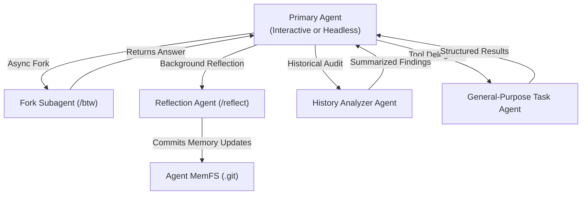

# Letta Code — Quick Reference & Architecture Guide

> **Package:** `@letta-ai/letta-code` | **Current Version:** `0.31.6` | **Runtime:** Node `>=22.19.0` (Distribution) / Bun `>=1.3.10` (Dev)  
> **Source Snapshot:** `.agent-state/learn/letta-ai/letta-code/origin/`

---

## 1. Executive Overview: What is Letta Code?

**Letta Code** is an open-source, stateful agent harness created by the authors of **MemGPT** and **sleep-time compute / dreaming research** (Letta AI). Unlike traditional stateless coding assistants that discard working state at the end of each session or rely purely on linear conversation logs, Letta Code agents possess **persistent identity, mutable structured memory, and longitudinal experience**.

```
┌────────────────────────────────────────────────────────────────────────┐
│                          Letta Code Topology                           │
└────────────────────────────────────────────────────────────────────────┘
                                    │
       ┌────────────────────────────┼────────────────────────────┐
       ▼                            ▼                            ▼
┌──────────────┐             ┌──────────────┐             ┌──────────────┐
│  Interactive │             │   Headless   │             │   Gateway /  │
│   TUI (Ink)  │             │   CLI (-p)   │             │   Channels   │
└──────┬───────┘             └──────┬───────┘             └──────┬───────┘
       │                            │                            │
       └────────────────────────────┼────────────────────────────┘
                                    ▼
       ┌─────────────────────────────────────────────────────────┐
       │             Turn & Tool Orchestration Engine            │
       │    (Permissions, Streaming, Interruption, Mod Engine)  │
       └────────────────────────────┬────────────────────────────┘
                                    │
       ┌────────────────────────────┴────────────────────────────┐
       ▼                                                         ▼
┌───────────────────────────────┐         ┌───────────────────────────────┐
│     Cloud / API Backend       │         │    In-Process Local Backend   │
│  (Letta Cloud / api.letta.com)│         │     (pi-ai Provider Seam)     │
└──────────────┬────────────────┘         └──────────────┬────────────────┘
               │                                         │
               └────────────────────┬────────────────────┘
                                    ▼
        ┌────────────────────────────────────────────────────────┐
        │         MemFS & Git-Versioned Agent Memory             │
        │ (~/.letta/agents/<agentId>/memory/ + system/ blocks)   │
        └────────────────────────────────────────────────────────┘
```

### Key Differences from Other Agent CLIs

| Dimension | Standard Agent CLIs (e.g., Aider, Claude Code, Gemini CLI) | Letta Code |
|---|---|---|
| **Memory Model** | Ephemeral or append-only conversation history; context resets per session. | **Structured, mutable memory blocks** (`persona`, `human`, custom) backed by a dedicated Git repository (**MemFS**). |
| **Self-Improvement** | Static prompt templates; cannot modify own core identity or skills without manual user file edits. | **Autonomous reflection & learning**: modifies its own system prompts, creates and edits skills (`/skill-creator`), and audits memory health (`/doctor`). |
| **Dreaming & Consolidation** | None; context window exhaustion triggers lossy compaction or truncation. | **Sleep-time compute (`/sleeptime`, `/reflect`)**: launches background subagents to distill multi-turn sessions into durable memories. |
| **Execution Topology** | Single-machine local terminal execution. | **Multi-environment & Remote**: route tasks to cloud sandboxes, remote servers (`letta server`), local TUI, or headless CI runners. |
| **Channel Connectivity** | Terminal-only or single webhook. | Native gateway for **Slack, Telegram, Discord, WhatsApp, Signal**, and custom channels. |
| **Extensibility Engine** | Simple prompt files or MCP only. | Layered: **MemFS memory blocks + Skills + MCP + In-Session TypeScript Mods + Lifecycle Hooks**. |

---

## 2. Installation & Setup Reference

Letta Code supports multiple distribution channels depending on deployment needs.

### Method A: Global Package Manager (npm / bun)
Distribution requires **Node.js `>= 22.19.0`**.

```bash
# Global install with npm
npm install -g @letta-ai/letta-code

# Global install with Bun
bun add -g @letta-ai/letta-code

# Verify installation
letta --version
```

### Method B: Nix Flake & NixOS
The repository provides a complete `flake.nix` with bundled runtime dependencies and offline prefetching via `bun.nix`.

```bash
# Ad-hoc execution without permanent installation
nix run github:letta-ai/letta-code

# Profile installation
nix profile install github:letta-ai/letta-code
```

**Home Manager Configuration:**
```nix
{
  inputs.letta-code.url = "github:letta-ai/letta-code";
  outputs = { self, nixpkgs, home-manager, letta-code, ... }: {
    homeConfigurations.dev = home-manager.lib.homeManagerConfiguration {
      pkgs = import nixpkgs { system = "x86_64-linux"; };
      modules = [
        letta-code.homeManagerModules.default
        { programs.letta-code.enable = true; }
      ];
    };
  };
}
```

**NixOS Always-On Service (Headless Listener / Gateway Host):**
```nix
{
  services.letta-code = {
    enable = true;
    environmentFile = "/run/secrets/letta-code.env";
    extraArgs = [ "listen" ];
  };
}
```

### Method C: Docker Container
Built on `node:22.19-bookworm-slim` with system cron, python3, git, and networking utilities:

```bash
# Build local image
docker build -f docker/Dockerfile -t letta-code:latest .

# Run interactive container mounted to workspace
docker run -it --rm \
  -v "$(pwd)":/workspace \
  -v "$HOME/.letta":/root/.letta \
  -e LETTA_API_KEY="$LETTA_API_KEY" \
  letta-code:latest letta
```

### Method D: Arch Linux (AUR)
```bash
# Stable release
yay -S letta-code

# Nightly / Git HEAD
yay -S letta-code-git
```

### Method E: Local Development Setup
The codebase is developed using **Bun** (`>=1.3.10`) with Biome for linting/formatting:

```bash
# 1. Clone repository
git clone https://github.com/letta-ai/letta-code.git
cd letta-code

# 2. Install dependencies (applies vendor patches automatically)
bun install

# 3. Launch dev mode (runs TypeScript source with LETTA_DEBUG=1)
bun run dev

# 4. Run the 12-check validation suite before making changes
bun run check

# 5. Build distribution artifacts (compiles to Node bundle in letta.js & dist/)
bun run build
```

---

## 3. CLI Commands, Flags & Core Features

### 3.1 CLI Startup Flags Cheat Sheet

```bash
letta [subcommand] [flags] [prompt]
```

| Flag | Mode | Description & Examples |
|---|---|---|
| `-h, --help` | Both | Display available CLI flags and usage. |
| `-v, --version` | Both | Print package version (`0.31.6`). |
| `--info` | Both | Display current working directory, discovered skills, and pinned agents. |
| `-r, --resume` | Interactive | Launch TUI and immediately open the agent selector. |
| `-C, --conversation <id>` | Both | Attach directly to an existing conversation ID. |
| `--new` | Both | Create a new conversation for the current agent (isolates context). |
| `--new-agent` | Both | Directly provision a new agent, bypassing profile selection. |
| `-a, --agent <id>` | Both | Specify exact agent ID to activate. |
| `-n, --name <name>` | Both | Select a pinned agent by name (case-insensitive). |
| `-m, --model <id>` | Both | Set model handle (e.g. `anthropic/claude-3-7-sonnet`, `opus-4.5`). |
| `-s, --system <id>` | Both | Apply system prompt preset ID (`default`, `custom`, etc.). |
| `--personality <name>` | Both | Agent personality preset: `letta-code`, `tutorial`, `blank`, `linus`, `kawaii`, `claude`, `codex`. |
| `--toolset <name>` | Both | Toolset mode: `auto` (default), `codex`, `default`, `gemini`. |
| `--backend <cloud\|local>`| Both | Select backend: `cloud` (Letta API) or `local` (in-process engine). |
| `-p, --prompt` | Headless | Run single-shot headless execution with trailing prompt. |
| `--output-format <fmt>` | Headless | Output format: `text` (default), `json`, `stream-json`. |
| `--input-format <fmt>` | Headless | Set to `stream-json` for bidirectional stdin/stdout pipelines. |
| `--environment <name>` | Headless | Target remote execution environment: `cloud`, or named host (`work-mac`). |
| `--from-agent <id>` | Headless | Inject caller metadata for agent-to-agent delegation reminders. |
| `--permission-mode <m>` | Both | Set authorization policy (`manual`, `auto`, `yolo`). |
| `--memfs` | Both | Force enable Git-backed memory filesystem. |
| `--ephemeral` | Headless | Run a temporary throwaway turn with no persistent memory or agent state. |
| `--no-mods` | Both | Disable local runtime TypeScript mods for this session. |
| `--skills <path>` | Both | Custom path to local skills directory (defaults to `.skills`). |
| `--skill-sources <csv>` | Both | Filter active sources: `all`, `bundled`, `global`, `agent`, `project`. |
| `--reflection-trigger <m>`| Both | Sleeptime reflection trigger: `off`, `step-count`, `compaction-event`. |
| `--reflection-step-count <n>`| Both | Trigger reflection every `N` steps (e.g., `20`). |

### 3.2 Key Subcommands

- **Agent Management:**
  ```bash
  letta agents list                  # List all agents on active backend
  letta agents delete <agent-id>     # Delete an agent
  ```
- **Remote Environments:**
  ```bash
  letta server                       # Turn current machine into an execution server
  letta server --env-name "dev-box"  # Assign custom environment name
  letta environments list            # List registered active remote machines
  letta environments current         # Show device identifier for this machine
  ```
- **Skill Management:**
  ```bash
  letta skills list --agent <id>                    # List skills linked to agent
  letta skills install https://github.com/org/repo  # Install from GitHub
  letta skills install <clawhub-slug>               # Install from ClawHub
  letta skills delete <skill-name> --agent <id>     # Delete skill
  ```
- **Daemon & Integrations:**
  ```bash
  letta listen                       # Start WebSocket listener for incoming turns
  letta channels start telegram      # Launch Telegram bridge gateway
  letta channels start slack         # Launch Slack bot gateway
  letta cron list                    # List scheduled cron jobs
  letta secret set KEY VALUE         # Store obfuscated environment secret
  ```

---

## 4. Interactive Slash Commands (`/`) Reference

Inside the interactive TUI, slash commands provide instant control over agent memory, context, and operational parameters:

```
┌────────────────────────────────────────────────────────────────────────┐
│                   Interactive Slash Commands Catalog                   │
├───────────────────┬───────────────────┬────────────────────────────────┤
│ Category          │ Command           │ Function                       │
├───────────────────┼───────────────────┼────────────────────────────────┤
│ Memory & Learning │ /init             │ Initialize or re-init memory   │
│                   │ /remember [text]  │ Record facts from turn         │
│                   │ /doctor           │ Audit memory health & drift    │
│                   │ /memory           │ View active memory blocks      │
│                   │ /palace           │ Open browser Memory Palace UI  │
│                   │ /memfs [action]   │ Manage Git MemFS (sync/reset)  │
│                   │ /memory-repository│ Link secondary Git remote      │
│                   │ /sleeptime        │ Configure reflection triggers  │
├───────────────────┼───────────────────┼────────────────────────────────┤
│ Agent & Context   │ /model            │ Switch LLM model               │
│                   │ /connect          │ Connect BYOK API keys          │
│                   │ /context          │ View token budget & usage      │
│                   │ /context-limit    │ Set maximum context window     │
│                   │ /compaction       │ Configure history summarizer   │
│                   │ /clear            │ Clear in-context message log   │
│                   │ /recompile        │ Recompile prompt cache         │
│                   │ /personality      │ Swap personality preset        │
│                   │ /system           │ Swap system prompt             │
│                   │ /toolset          │ Switch active toolset          │
├───────────────────┼───────────────────┼────────────────────────────────┤
│ Multi-Agent       │ /new              │ Start clean conversation       │
│ & Branching       │ /fork             │ Branch current conversation    │
│                   │ /btw <question>   │ Background side-branch query   │
│                   │ /reflect [opts]   │ Launch manual reflection agent │
│                   │ /subagents        │ Manage custom subagents        │
│                   │ /pin [name]       │ Pin agent to quick selector    │
│                   │ /export           │ Export AgentFile (.af) bundle  │
├───────────────────┼───────────────────┼────────────────────────────────┤
│ Extensibility     │ /skills           │ Browse installed skills        │
│ & System          │ /skill-creator    │ Interactive skill authoring    │
│                   │ /mcp              │ Manage MCP server connections  │
│                   │ /mods             │ Inspect / learn runtime mods   │
│                   │ /hooks            │ Configure lifecycle hooks      │
│                   │ /statusline       │ Customize TUI statusline       │
│                   │ /secret           │ Shell secret management        │
│                   │ /terminal         │ Install Shift+Enter bindings   │
└───────────────────┴───────────────────┴────────────────────────────────┘
```

---

## 5. Memory Architecture & MemFS Operations

Letta Code implements a dual-tier memory system: **In-Context Structured Blocks** and **Filesystem Git Repositories (MemFS)**.

```
~/.letta/agents/<agent-id>/
├── memory/                      <-- Local Git Repository (MemFS Root)
│   ├── .git/                    <-- Tracks memory mutations across turns
│   ├── system/                  <-- Core active memory blocks
│   │   ├── persona.md           <-- Agent personality, tone, directives
│   │   ├── human.md             <-- User preferences, facts, profile
│   │   └── project.md           <-- Working conventions, repository facts
│   └── reference/               <-- On-demand retrieval files
└── skills/                      <-- Agent-scoped learned skills
```

### 5.1 Memory Operations Workflow

1. **Explicit Memory Insertion (`/remember`):**
   The user instructs the agent to store a rule, preference, or architectural fact. The agent modifies `system/human.md` or `system/persona.md`.
2. **Git Commit on Mutation:**
   Every memory block edit creates an atomic commit in `~/.letta/agents/<agentId>/memory/.git/`.
3. **External Sync (`/memory-repository`):**
   MemFS can mirror its commit tree to an external private Git repository (e.g. GitHub/GitLab):
   ```bash
   /memory-repository set git@github.com:my-org/my-agent-memory.git
   /memory-repository push
   ```
4. **Sleep-Time Compute & Dreaming:**
   When step count exceeds the configured interval (e.g. 20 turns) or `/reflect` is invoked:
   - A dedicated `reflection` subagent spawns with access to conversation transcripts.
   - It summarizes key decisions, identifies obsolete notes, and rewrites MemFS files.
   - Changes are merged into primary agent context either immediately or on next turn.
5. **Memory Palace Visualizer (`/palace`):**
   Launches a local web dashboard displaying:
   - Visual memory graph nodes (blocks, system prompts, references).
   - Git commit history diffs over time.
   - Active skill definitions.

---

## 6. Multi-Agent & Subagent Workflows

Letta Code treats multi-agent delegation as a native execution primitive. Agents can invoke child subagents synchronously or asynchronously.



### Built-in Subagent Profiles
Located in `src/agent/subagents/builtin/`:

- **`general-purpose.md`**: Broad reasoning, tool execution, and code searches in an isolated context window.
- **`fork.md`**: Clones recent conversation turns to investigate alternative solutions without polluting parent history.
- **`reflection-v2.md`**: Audits recent multi-turn transcripts, updates MemFS system blocks, and discards stale facts.
- **`history-analyzer-v2.md`**: High-depth search across historical conversations and archived sessions.
- **`init-v2.md`**: Scans unfamiliar repositories and seeds the initial project memory baseline.

### Session Forking Patterns
- **`/fork`**: Splits the active conversation into a new branch. The parent conversation remains untouched at that point.
- **`/btw <question>`**: Runs a non-blocking background branch to answer an exploratory question (e.g. `/btw what was the flag for strict mode again?`), returning the response as a status card.

---

## 7. Configuration & Environment Reference

### 7.1 Configuration Hierarchy (3-Level Precedence)

```
1. CLI Flags & Process Environment Variables (Highest Precedence)
        │
        ▼
2. Local Project Settings: ./.letta/settings.local.json
        │
        ▼
3. Checked-in Project Settings: ./.letta/settings.json
        │
        ▼
4. Global User Settings: ~/.letta/settings.json (Lowest Precedence)
```

#### Settings Schema (`~/.letta/settings.json`)
```json
{
  "tokenStreaming": true,
  "reasoningTabCycleEnabled": false,
  "showCompactions": false,
  "sessionContextEnabled": true,
  "autoConversationTitles": true,
  "autoSwapOnQuotaLimit": true,
  "includeWorktreeTool": true,
  "preferredBackendMode": "api",
  "recentModels": [
    "anthropic/claude-3-7-sonnet",
    "openai/o3-mini"
  ],
  "reflectionTrigger": "step-count",
  "reflectionStepCount": 20,
  "reflectionMerge": "immediate",
  "permissions": {
    "rules": [
      { "tool": "read_file", "policy": "auto" },
      { "tool": "bash", "policy": "manual" }
    ]
  },
  "hooks": {
    "pre-turn": "scripts/audit-workspace.sh",
    "post-turn": "scripts/notify-slack.sh"
  }
}
```

### 7.2 Project Configuration Files

#### `bunfig.toml` (Bun Runtime & Test Configuration)
```toml
# Bun runtime configuration for Letta Code
[loader]
".mdx" = "text"
".md" = "text"
".txt" = "text"

[test]
preload = ["./scripts/test-home-preload.ts"]
```

#### `biome.json` (Code Style & Architectural Boundary Rules)
```json
{
  "$schema": "https://biomejs.dev/schemas/2.2.5/schema.json",
  "formatter": {
    "enabled": true,
    "indentStyle": "space",
    "indentWidth": 2
  },
  "linter": {
    "enabled": true,
    "rules": {
      "recommended": true,
      "style": {
        "noDefaultExport": "error",
        "noRestrictedImports": {
          "level": "error",
          "options": {
            "paths": {
              "./telemetry": "Use @/telemetry instead of relative import (preserves singleton)",
              "@earendil-works/pi-ai/compat": "Deprecated pre-Models runtime surface. Use root entrypoint."
            }
          }
        }
      }
    }
  }
}
```

### 7.3 Environment Variables Reference

| Environment Variable | Description |
|---|---|
| **Core & Debugging** | |
| `LETTA_DEBUG=1` | Enable verbose diagnostic logging to stderr/file. |
| `LETTA_DEBUG_FLICKER=1` | Enable TUI re-render trigger debugging. |
| `LETTA_DISABLE_MODS=1` | Disable all in-session TypeScript mods (recovery mode). |
| `LETTA_MEMORY_DIR` / `MEMORY_DIR` | Override the root path for MemFS operations. |
| `LETTA_PACKAGE_MANAGER` | Package manager inside containers (`npm`, `bun`, `pnpm`). |
| **Backend & Cloud** | |
| `LETTA_BASE_URL` | Base API URL for Letta Cloud backend (default: `https://api.letta.com`). |
| `LETTA_API_KEY` | Authentication bearer token for Letta Cloud. |
| `LETTA_LOCAL_BACKEND_EXPERIMENTAL=1` | Activate experimental local in-process execution backend. |
| `LETTA_LOCAL_BACKEND_DIR` | Storage root for local backend state (`~/.letta/lc-local-backend`). |
| `LETTA_LOCAL_BACKEND_EXECUTOR` | Execution engine: `deterministic` (for tests) or `live`. |
| **Model Providers (BYOK)** | |
| `ANTHROPIC_API_KEY` | Anthropic Claude models (`claude-3-7-sonnet`, `claude-3-5-sonnet`). |
| `OPENAI_API_KEY` | OpenAI models (`gpt-4o`, `o1`, `o3-mini`). |
| `GEMINI_API_KEY` | Google Gemini models (`gemini-2.5-pro`, `gemini-2.5-flash`). |
| `OPENROUTER_API_KEY` | OpenRouter unified model gateway. |
| `ZAI_API_KEY` | Z.ai API / Coding plan key. |
| `MINIMAX_API_KEY` | MiniMax API key. |
| `MOONSHOT_API_KEY` | Moonshot / Kimi Code API key. |
| `AWS_ACCESS_KEY_ID` / `AWS_SECRET_ACCESS_KEY` / `AWS_REGION` | AWS Bedrock Claude models. |
| **Channels & Gateway** | |
| `SLACK_BOT_TOKEN` / `SLACK_SIGNING_SECRET` | Slack app connector bot credentials. |
| `TELEGRAM_BOT_TOKEN` | Telegram bot gateway credentials. |
| `DISCORD_BOT_TOKEN` | Discord bot integration credentials. |

---

## 8. Model Provider Setup & BYOK (Bring Your Own Key)

Letta Code supports both managed cloud routing and direct BYOK provider connections via `/connect` or environment variables:

```
┌────────────────────────────────────────────────────────────────────────┐
│                        Provider Adapters Matrix                        │
├───────────────────┬───────────────────┬────────────────────────────────┤
│ Provider          │ Auth Types        │ Typical Endpoint / Models      │
├───────────────────┼───────────────────┼────────────────────────────────┤
│ Anthropic         │ API Key           │ api.anthropic.com (Claude 3.7) │
│ OpenAI            │ API Key, OAuth    │ api.openai.com (GPT-4o, o3)    │
│ ChatGPT / Codex   │ OAuth (Plus/Pro)  │ ChatGPT Coding Plan OAuth      │
│ Google Gemini     │ API Key           │ generativelanguage.googleapis  │
│ AWS Bedrock       │ IAM Keys, Profile │ Claude on AWS Bedrock          │
│ OpenRouter        │ API Key, OAuth    │ openrouter.ai/api/v1           │
│ Ollama (Local)    │ Zero-Key / BaseURL│ http://localhost:11434/v1      │
│ OpenAI-Compatible │ API Key + BaseURL │ Any custom v1/chat completions │
│ zAI Coding Plan   │ API Key           │ Z.ai dedicated coding endpoint │
│ Kimi / Moonshot   │ API Key           │ api.moonshot.cn                │
└───────────────────┴───────────────────┴────────────────────────────────┘
```

### Connecting via Interactive CLI:
Run `/connect` inside the TUI to open the visual provider selector, or run:
```bash
letta subcommands connect
```

### Using Local Models (Ollama):
1. Start local Ollama: `ollama run qwen2.5-coder:32b`
2. Connect in Letta:
   - Endpoint: `http://localhost:11434/v1`
   - Model ID: `ollama/qwen2.5-coder:32b`
   - API Key: `none` (or leave blank)

---

## 9. Developer Guidelines & Safety Gotchas

When extending or modifying the Letta Code codebase:

1. **Imports & Aliases:**
   - **Never use parent relative paths (`../`)**. All imports across directories must use the `@/` alias (e.g. `import { getBackend } from "@/backend"`).
   - Biome and pre-commit hooks strictly block `../`.
2. **Strict File Naming:**
   - Source files: `kebab-case.ts` (e.g. `local-store.ts`).
   - React components: `PascalCase.tsx` (e.g. `AgentSelector.tsx`).
3. **Export Conventions:**
   - **No default exports (`export default`)**. Every export must be a named export (`export function foo()`).
4. **Circular Dependencies:**
   - Must be exactly `0`. Checked with `madge --circular src/`.
5. **Architectural Layer Boundaries:**
   - High-level layers cannot be imported by low-level layers:
     `cli/` -> `websocket/` -> `agent/` -> `tools/` -> `backend/` -> `providers/` -> `permissions/` -> `utils/`.
6. **Runtime Duality:**
   - Development runs on **Bun** (`bun run dev`).
   - Distribution runs on **Node 22.19+** (`letta.js`). Always verify native bridge integrations (like `node-pty`) across both runtimes.
7. **TUI Flicker Prevention:**
   - Do not add raw `useState` or `useReducer` to `App.tsx` that triggers on streaming chunks or keypresses. Use refs or `React.memo` components.
