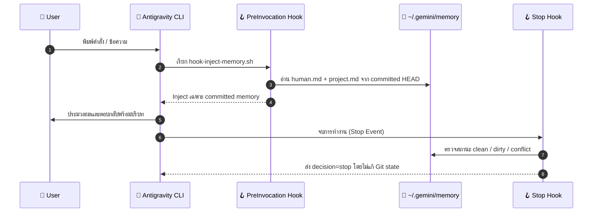

# 📦 คู่มือและรายละเอียดการติดตั้ง `agy-memory-layer` (Installation Lifecycle)

เอกสารฉบับนี้อธิบายอย่างละเอียดว่า เมื่อรันสคริปต์ `./plugins/agy-memory-layer/scripts/install.sh` ระบบจะไปทำอะไร ที่ไหน อย่างไรบ้าง ทั้งในเครื่องของคุณและในระบบของ Antigravity CLI

---

## 🗺️ แผนผังโฟลเดอร์และ Path ทั้งหมดที่เกี่ยวข้อง

```text
[เครื่องของคุณ / Host Machine]
│
├── 1. Source Repository (ที่ตั้งโปรเจกต์นี้)
│   └── plugins/agy-memory-layer/
│       ├── plugin.json
│       ├── hooks.json
│       ├── agents/                  [Declarative Subagent Role Manifests (6 Roles)]
│       ├── prompts/                 [Prompt Warehouse (system, persona, subagents)]
│       ├── rules/AGENTS.md
│       ├── skills/*/SKILL.md
│       └── scripts/*.ts / *.sh
│
├── 2. Antigravity Plugins Directory (ระดับ Global)
│   └── ~/.gemini/antigravity-cli/plugins/
│       └── agy-memory-layer  ─────────────► [Symlink ชี้กลับมาที่ Source Repo]
│
└── 3. Memory Git Storage Directory (ที่เก็บข้อมูล Memory)
    └── ~/.gemini/memory/                    [Git Repository แยกอิสระ]
        ├── .git/                            [Commit History & Snapshots]
        ├── global/
        │   ├── human.md                     [User Profile & Preferences]
        │   └── persona.md                   [Agent Persona]
        └── projects/
            └── <project-slug>/              [แยกตามชื่อแต่ละโปรเจกต์]
                ├── project.md
                ├── rules.md
                └── learnings/
```

State ชั่วคราวของ proposal และ Dream cursor จะอยู่ที่ `~/.gemini/memory.state/` แยกจาก Git repository จึงไม่ถูก inject เข้า prompt และไม่ติดไปกับ memory commit
---

## ⚡ วิธีการติดตั้ง (Installation Methods)

### 1. แบบ One-Liner (คำสั่งเดียว ไม่ต้อง Clone - แนะนำ)
รันคำสั่งนี้ใน Terminal เครื่องใดก็ได้:
```bash
curl -fsSL https://raw.githubusercontent.com/mahirocoko/agy-memory-layer/main/install.sh | bash
```

### 2. แบบ Clone Source Code
```bash
git clone https://github.com/mahirocoko/agy-memory-layer.git
cd agy-memory-layer
./install.sh
```

---

## 🔍 ขั้นตอนการทำงานของ `install.sh` อย่างละเอียด (Step-by-Step)

### Step 1: ปรับสิทธิ์การรันไฟล์ Script (Permissions)
- **คำสั่ง**: `chmod +x plugins/agy-memory-layer/scripts/*.sh`
- **สิ่งที่เกิดขึ้น**: ให้สิทธิ์ execute กับสคริปต์ทั้งหมดในโฟลเดอร์ `scripts/` เพื่อให้ Antigravity CLI สามารถเรียกใช้งาน Hook และ Palace Generator ได้

### Step 2: สร้างและตั้งค่า Git Memory Repository (`~/.gemini/memory/`)
- **โฟลเดอร์เป้าหมาย**: `/Users/<username>/.gemini/memory/`
- **สิ่งที่เกิดขึ้น**:
  1. สร้างโฟลเดอร์ `~/.gemini/memory/global/` และ `~/.gemini/memory/projects/`
  2. ตรวจสอบว่ามี `.git/` อยู่หรือไม่ ถ้ายังไม่มีจะสั่ง:
     ```bash
     git init -b main
     ```
  3. สร้างไฟล์ Template เริ่มต้น (หากยังไม่มี):
     - `global/human.md` : ใส่ค่าเริ่มต้น เช่น การใช้ `-E` flag, ภาษาที่ชอบ, การเขียนโค้ดแบบ strict type
     - `global/persona.md` : กำหนดบทบาทของ Agent ให้เป็น Stateful Pair Programmer
  4. ทำการ Commit ครั้งแรก:
     ```bash
     git add global/human.md global/persona.md
     git commit -m "memory-layer: initial memory repository bootstrap"
     ```

### Step 3: ทำการเชื่อมโยง Plugin เข้ากับ Antigravity CLI (Symlink)
- **โฟลเดอร์เป้าหมาย**: `~/.gemini/antigravity-cli/plugins/`
- **สิ่งที่เกิดขึ้น**:
  1. สร้างโฟลเดอร์ `~/.gemini/antigravity-cli/plugins/` หากยังไม่มี
  2. ลบเฉพาะ symlink เก่าที่ปลายทางมี manifest ยืนยันว่าเป็น `agy-memory-layer` ถ้าเป็น path หรือ symlink ของระบบอื่น script จะหยุดทันที
  3. สร้าง Symbolic Link จาก Source โฟลเดอร์ไปยังระบบของ Antigravity CLI:
     ```bash
     ln -sf "/path/to/plugins/agy-memory-layer" "~/.gemini/antigravity-cli/plugins/agy-memory-layer"
     ```
  *ผลลัพธ์: ทำให้ Antigravity CLI ค้นพบ Plugin นี้ในฐานะ Global Plugin โดยอัตโนมัติ ไม่ว่าจะเปิดทำงานในโฟลเดอร์ไหน*

### Step 4: ทดสอบความถูกต้องของ Hook Scripts (Sanity Check)
- **สิ่งที่เกิดขึ้น**:
  1. ทดลองยิง Mock JSON เข้า `hook-inject-memory.sh` เพื่อเช็คว่า script ส่ง JSON ถูก schema และอ่าน memory จาก committed `HEAD` ได้
  2. ทดลองยิง Mock JSON เข้า `hook-memory-status.sh` เพื่อเช็คว่า Stop ส่ง `{"decision":"stop"}` โดยไม่แก้ไฟล์ ไม่ stage และไม่ commit

---

## ⚡ วงจรการทำงานเมื่อ Agent ทำงานจริง (Runtime Lifecycle)

เมื่อติดตั้งเสร็จแล้ว ในทุกๆ ครั้งที่คุณใช้งาน Antigravity CLI:



ถ้า repository มีไฟล์ที่ยังไม่ commit รอบถัดไปจะยังใช้เนื้อหาจาก `HEAD` เดิม พร้อมแจ้งสถานะ dirty แยกต่างหาก ไฟล์ใหม่จะ active ก็ต่อเมื่อผ่าน writer ที่ตรวจ path และ commit เฉพาะไฟล์ของงานนั้นแล้ว

---

## 🔄 รายละเอียดการอัปเดตเวอร์ชันใหม่ (`update.sh`)

หลังอัปเดต source checkout หรือรัน root installer เพื่อดึง remote cache แล้ว ใช้คำสั่งนี้เพื่อ refresh การติดตั้งที่ active อยู่:

```bash
# Refresh permissions, symlink และ hooks จาก source ปัจจุบัน
./plugins/agy-memory-layer/scripts/update.sh
```

`update.sh` **ไม่ได้สั่ง `git pull` และไม่ได้ดาวน์โหลด release ใหม่** หน้าที่ของมันมีแค่:

1. ตั้งสิทธิ์ execute ให้ scripts และ hooks
2. Refresh symlink ที่ Antigravity CLI ใช้อยู่
3. ตรวจ lifecycle hooks ทุกครั้ง และตรวจ plugin schema ด้วย `agy plugin validate` เมื่อเครื่องมี `agy` CLI
4. ไม่ stage, commit หรือลบไฟล์ใน `~/.gemini/memory/`

ถ้าเป็น local checkout ให้อัปเดต source ด้วย Git ก่อน ถ้าติดตั้งแบบ one-liner ให้รัน root installer ซ้ำเพื่ออัปเดต remote cache แล้วค่อยใช้ `/update`

---

เมื่อคุณต้องการลบหรือถอนการติดตั้ง:

### 1. แบบปกติ (Safe Uninstall - แนะนำ)
```bash
./plugins/agy-memory-layer/scripts/uninstall.sh
```
- **สิ่งที่ถูกลบ**: ลบ symlink ที่ยืนยัน ownership แล้วจากทั้ง `~/.gemini/antigravity-cli/plugins/agy-memory-layer` และ `~/.gemini/config/plugins/agy-memory-layer`
- **สิ่งที่ยังอยู่**: ข้อมูล Memory ใน `~/.gemini/memory/` **จะยังอยู่ครบทั้งหมด** (หากลงใหม่ในอนาคต ความรู้เดิมจะไม่หาย)

### 2. แบบล้างหมดจด (Complete Purge)
```bash
./plugins/agy-memory-layer/scripts/uninstall.sh --purge --confirm-purge
```
- **สิ่งที่ถูกลบ**: ลบ symlink ของ Plugin ทั้งสองตำแหน่ง และลบโฟลเดอร์ `~/.gemini/memory/` ออกจากเครื่องทั้งหมด
- คำสั่งนี้ลบข้อมูลถาวร จึงต้องใส่ `--confirm-purge` ซ้ำอีกชั้น และ script จะไม่ purge ถ้า memory root เป็น symlink หรือไม่มีโครงสร้าง MemFS ที่ยืนยันได้ ส่วน symlink ของ plugin จะถูกลบก็ต่อเมื่อ manifest ปลายทางเป็น `agy-memory-layer` เท่านั้น ถ้าต้องการเก็บความจำ อย่าใช้ `--purge`

---

## 🛠️ วิธีตรวจสอบความเรียบร้อยด้วยตัวเอง

```bash
# 1. เช็คว่า Plugin ถูก Symlink ไปที่ Antigravity CLI แล้วหรือยัง
ls -la ~/.gemini/antigravity-cli/plugins/

# 2. เช็คว่า Git Memory Repository ทำงานปกติหรือไม่
git -C ~/.gemini/memory log --oneline

# 3. ทดลองเปิด Memory Palace ตรวจสอบข้อมูลใน Browser
./plugins/agy-memory-layer/scripts/palace-server.sh --open
```
