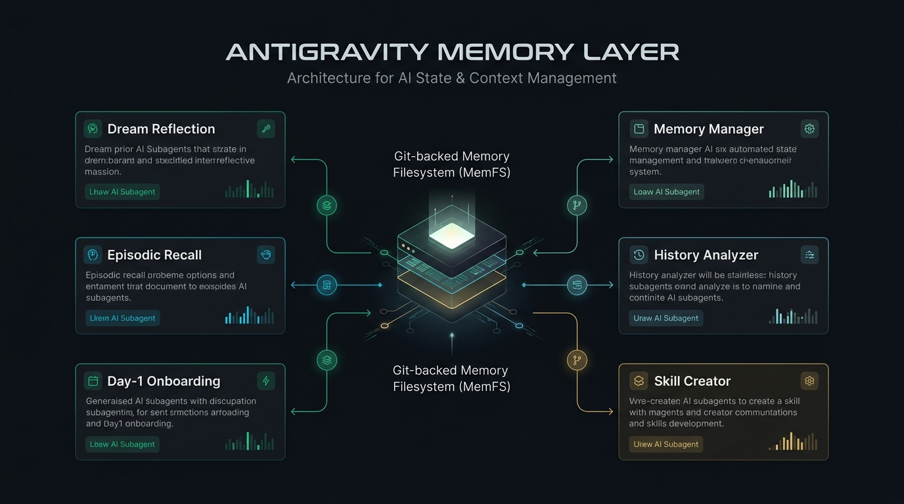
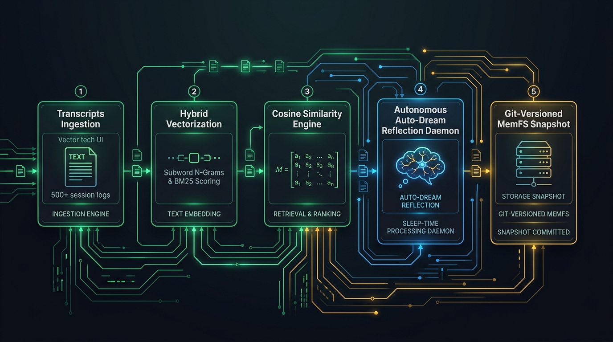

# 🧠 agy-memory-layer

[](./TEST_REPORT.md)
[-success.svg)](./TEST_REPORT.md)
[](https://nodejs.org)
[](https://github.com/google/antigravity)
[](https://opensource.org/licenses/MIT)

> **Stateful Git-Backed Memory Layer, Sleep-Time Reflection, Codebase Onboarding, and Memory Palace Plugin for Antigravity CLI (`agy`)**  
> *Inspired by the dual-memory architecture of [Letta Code](https://github.com/letta-ai/letta-code).*

<p align="center">
  
</p>

---

## 🤖 Full 6-Subagent Suite (Complete Letta Code Parity)

`agy-memory-layer` ships with 6 declarative First-Class Subagents designed for Antigravity CLI:

<p align="center">
  
</p>

| Subagent & Manifest | Role & Responsibilities | Model | Tools Allowed |
| :--- | :--- | :---: | :---: |
| **`dream_agent`**<br/>↳ [`dream_subagent.md`](./plugins/agy-memory-layer/prompts/subagents/dream_subagent.md) | **Dream Reflection Subagent**<br/>Analyzes transcripts, captures user preferences (*The Annoyance Rule*), and updates MemFS. | `inherit` | `Write` (MemFS) |
| **`recall_agent`**<br/>↳ [`recall_subagent.md`](./plugins/agy-memory-layer/prompts/subagents/recall_subagent.md) | **Episodic Recall Specialist**<br/>Searches past 500+ transcripts via Hybrid Vector Cosine Similarity. | `flash` | `Read-only` |
| **`onboarding_agent`**<br/>↳ [`onboarding.md`](./plugins/agy-memory-layer/prompts/subagents/onboarding.md) | **Codebase Onboarding Specialist**<br/>Explores repositories on Day 1 to bootstrap `project.md` and `rules.md`. | `flash` | `Write` (MemFS) |
| **`memory_agent`**<br/>↳ [`remember.md`](./plugins/agy-memory-layer/prompts/subagents/remember.md) | **MemFS Memory Specialist**<br/>Proactively updates, organizes, and prunes core memory blocks. | `inherit` | `Write` (MemFS) |
| **`history_analyzer_agent`**<br/>↳ [`recall_subagent_local.md`](./plugins/agy-memory-layer/prompts/subagents/recall_subagent_local.md) | **Deep History Analyzer**<br/>Investigates multi-step debugging traces across local conversation transcripts. | `flash` | `Read-only` |
| **`skill_creator_agent`**<br/>↳ [`skill_creator.md`](./plugins/agy-memory-layer/prompts/subagents/skill_creator.md) | **Skill Creator Specialist**<br/>Designs, authors, tests, and validates new Antigravity skills. | `pro` | `Write` |

---

## 🧠 Hybrid Semantic Recall & Auto-Dream Lifecycle

<p align="center">
  
</p>

- **Vector Semantic Search**: Subword n-gram vector embeddings + BM25 keyword matching with cosine similarity scoring.
- **Autonomous Sleep-Time Reflection**: Background daemon (`dream-daemon.ts`) discovers undreamed sessions across `brain/` and distills permanent learnings automatically.

---

## ✨ Features

- 👤 **In-Context Memory Blocks**: Automatically injects your user profile (`human.md`), project architecture (`project.md`), and repo rules (`rules.md`) before every invocation.
- 📦 **Git-Backed MemFS (`~/.gemini/memory/`)**: Decoupled from project source code; tracks all knowledge snapshots in an independent Git repository.
- ⚡ **Zero-Friction Lifecycle Hooks**:
  - `PreInvocation`: Ingests active memory blocks into the prompt context via `ephemeralMessage`.
  - `Stop`: Auto-commits memory snapshots to Git after every turn with zero manual effort.
- 🧠 **Hybrid Semantic Recall (`/recall`)**: Subword n-gram vector embeddings + BM25 keyword fusion across 500+ past Antigravity conversation transcripts.
- 🌙 **Sleep-Time Dreaming (`/dream` & `dream-daemon.ts`)**: Spawns background subagents or background cron daemon to distill learnings into MemFS.
- 🏛️ **Memory Palace (`/palace`)**: Interactive visual dashboard in your browser to inspect memory graphs, synapses, and Git commit timelines with anti-cache headers.
- 🩺 **Memory Health Auditor (`/doctor`)**: Audits memory consistency and flags drift between memory rules and actual codebase state.
- 🔌 **Standard Plugin Lifecycle**: Installs via symlink, toggleable with `agy plugin enable/disable`, and cleanly uninstallable.

---

## 🚀 Quick Start

### 1. One-Line Installation (No Clone Needed)

Install directly to your machine with a single terminal command:

```bash
curl -fsSL https://raw.githubusercontent.com/mahirocoko/agy-memory-layer/main/install.sh | bash
```

### 2. Manual Installation from Source

If you prefer to clone and develop locally:

```bash
git clone https://github.com/mahirocoko/agy-memory-layer.git
cd agy-memory-layer
./install.sh
```

The installer will:
1. Initialize the Git-backed memory repository at `~/.gemini/memory/`.
2. Seed default template files (`human.md`, `persona.md`).
3. Symlink the plugin bundle to `~/.gemini/antigravity-cli/plugins/agy-memory-layer`.
4. Validate lifecycle hook scripts.

> 📖 **Want to know exactly what happens during installation?**  
> Check out the in-depth [INSTALLATION_DETAILS.md](./INSTALLATION_DETAILS.md) guide.

---

## 🛠️ Slash Commands & Skills

Once installed, the following commands are available directly inside Antigravity CLI:

| Command | Description | Example Usage |
| :--- | :--- | :--- |
| **`/init`** | **Day 1 Onboarding**: Scans codebase architecture, entry points, linters, and scripts to seed `project.md` and `rules.md` immediately. | `/init` or `/init --force` |
| **`/memory`** | Inspect active memory blocks and recent Git snapshot history. | `/memory` |
| **`/memory search`** | Fast ranked search across historical `learnings/` logs, project rules, and global memory. | `/memory search docker` |
| **`/recall`** | Hybrid Semantic Search across all 500+ past conversation sessions (Keywords + Vector Cosine Similarity). | `/recall palace token` or `/recall search "setup" --semantic` |
| **`/remember`** | Record a preference, style guideline, or project rule into MemFS. | `/remember Always use exact flag (-E) when installing packages` |
| **`/persona`** | Switch or inspect the active personality preset (`memo`, `linus`, `tutor`, `kawaii`, `architect`, `blank`). | `/persona linus` or `/persona list` |
| **`/dream`** | Sleep-time reflection subagent and background daemon (`dream-daemon.ts`) to synthesize session learnings. | `/dream` or `node --experimental-strip-types scripts/dream-daemon.ts --run-now` |
| **`/doctor`** | Check memory health and detect rule contradictions with codebase. | `/doctor` |
| **`/palace`** | Generate and open the interactive Memory Palace web dashboard. | `/palace` or `/palace --summary` |
| **`/sync-letta`** | 4-step Agentic Cognitive Grooming to sync core memory from Letta Code (`~/.letta`). | `/sync-letta` |
| **`/sync`** | Sync MemFS with a remote private Git repository across multiple development machines. | `/sync setup <repo-url>` or `/sync push` |
| **`/update`** | Update plugin to latest version while safely preserving all stored MemFS memory. | `/update` |

---

## 📁 Memory Storage Architecture

Memory files are stored outside the active workspace under `~/.gemini/memory/`:

```text
~/.gemini/memory/                # Standalone Git Repository
├── .git/                        # Full commit history & snapshots
├── global/
│   ├── human.md                 # User profile, coding habits, quirks
│   └── persona.md               # Agent personality & core instructions
└── projects/
    └── <project-slug>/          # Project-specific memory (auto-resolved from workspace)
        ├── project.md           # Architecture decisions & domain context
        ├── rules.md             # Project-specific coding rules
        └── learnings/           # Dated learning logs (YYYY-MM-DD_topic.md)
```

---

## 🏛️ Memory Palace Web Visualizer

Run `/palace` or invoke the script directly to open the Memory Palace in your browser:

```bash
./plugins/agy-memory-layer/scripts/palace-server.sh --open
```

It renders an interactive dashboard showing:
- 🌐 Global memory blocks (`human.md`, `persona.md`)
- 📁 Project-scoped memory blocks & learnings
- 📜 Git commit timeline of all memory snapshots

---

## 📦 Memory Backup & Migration Tool (`tools/memory-backup.ts`)

Export, verify, and restore MemFS memory blocks across machines into a single standalone bundle with **SHA-256 cryptographic integrity verification**:

```bash
# 1. Export memory blocks to bundle file
node --experimental-strip-types tools/memory-backup.ts export -o ./memory-backup.json

# 2. Verify bundle integrity & tamper detection
node --experimental-strip-types tools/memory-backup.ts verify -i ./memory-backup.json

# 3. Import & restore memory blocks to target MemFS (with Git auto-commit)
node --experimental-strip-types tools/memory-backup.ts import -i ./memory-backup.json
```

**Key Capabilities:**
- 🛡️ **SHA-256 Verification**: Computes per-file checksums and an overall payload signature; detects and rejects corrupted/tampered bundles.
- 🎯 **Selective Export**: Filter by specific project slugs via `--project <slug>`.
- 🧪 **Dry-Run Mode**: Test and preview restoration with `--dry-run` without writing to disk.
- 🔒 **Project Rule Adherence**: Implemented strictly with TypeScript `type` aliases (0% `interface`).

---

## ⚙️ Plugin Management

### Updating to Latest Version
```bash
# Update plugin files and refresh hooks in one command (keeps your memory safe)
./plugins/agy-memory-layer/scripts/update.sh
```

### Temporarily Enable / Disable
```bash
# Disable plugin (hooks & skills stay inactive, data is preserved)
agy plugin disable agy-memory-layer

# Re-enable plugin
agy plugin enable agy-memory-layer
```

### Uninstallation
```bash
# Option 1: Safe uninstall (removes plugin, keeps Git memory repo intact)
./plugins/agy-memory-layer/scripts/uninstall.sh

# Option 2: Complete purge (removes plugin and deletes ~/.gemini/memory/)
./plugins/agy-memory-layer/scripts/uninstall.sh --purge
```

---

## 🧪 Testing & Code Coverage

`agy-memory-layer` comes with a comprehensive multi-tier automated test suite verifying lifecycle hooks, memory isolation, rollback integrity, plugin schema validation, and Day 1 onboarding.

### Running Tests Locally

```bash
# Run 11 integration scenarios plus 15 focused unit cases
pnpm test

# Run test suite with V8 code coverage report
pnpm test:coverage
```

### 📈 Code Coverage Report (Node.js Native V8 Coverage Engine)

| Subsystem / Script | Line % | Branch % | Function % | Status |
| :--- | :---: | :---: | :---: | :---: |
| `plugins/agy-memory-layer/scripts/hook-auto-commit.ts` | **70.37%** | 38.46% | **100.00%** | 🟢 High |
| `plugins/agy-memory-layer/scripts/hook-inject-memory.ts` | **73.33%** | 30.00% | 55.56% | 🟡 Moderate |
| `plugins/agy-memory-layer/scripts/init-project-memory.ts` | **88.89%** | 54.35% | **87.50%** | 🟢 High |
| `plugins/agy-memory-layer/scripts/memory-search.ts` | **87.43%** | 55.17% | 58.33% | 🟢 High |
| `plugins/agy-memory-layer/scripts/palace-generator.ts` | **86.04%** | 46.48% | 59.09% | 🟢 High |
| `tools/memory-backup.ts` | **91.33%** | 69.15% | **100.00%** | 🟢 Very High |
| `tests/run-test-suite.ts` | **86.41%** | 31.15% | **100.00%** | 🟢 High |
| **All Files (Current Suite)** | **75.69%** | **54.74%** | **77.03%** | 🟢 **Healthy** |

> 📋 **Detailed Test Run Evidence**: See [TEST_REPORT.md](./TEST_REPORT.md) for the latest isolated scenario results and measured timings.

---

## 📄 License & Acknowledgements

- **License**: MIT
- **Inspiration**: [Letta Code](https://github.com/letta-ai/letta-code) by the Letta AI team.
