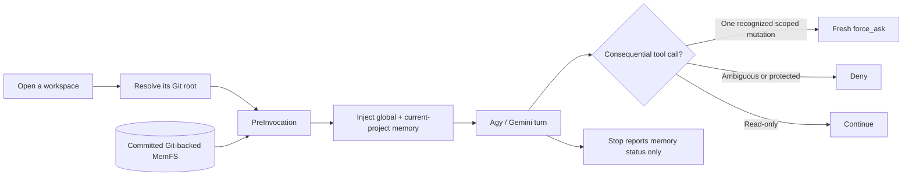

# 🧠 agy-memory-layer

[](./docs/releases/v1.21.0.md)
[](./CONTRACT.md)
[-success.svg)](./TEST_REPORT.md)
[](https://nodejs.org)
[](https://opensource.org/licenses/MIT)

**Persistent, Git-backed memory and evidence-controlled execution for Antigravity CLI (`agy`).**

`agy-memory-layer` helps Gemini carry useful context across conversations without treating old
summaries, uncommitted notes, or model confidence as current truth. It injects only committed global
and current-project memory, keeps learning explicit, and adds bounded safeguards for consequential
actions and completion claims.

> **Current release:** `v1.21.0` — ready for interactive, human-supervised use. It improves context
> continuity, mutation gating, and evidence quality; it does not turn Gemini into an autonomous or
> safety-trusted supervisor. See the [release notes](./docs/releases/v1.21.0.md).

## Why it exists

Long-running coding work usually fails in familiar ways:

- a new conversation forgets preferences and project decisions;
- a long conversation keeps stale assumptions after the repository changes;
- memory from one project leaks into another;
- broad approval is mistaken for permission to perform a different mutation;
- an agent reports success from a green proxy instead of the requested outcome.

This plugin gives Agy a smaller, inspectable operating layer:

| Problem | What the plugin does |
| :--- | :--- |
| Context disappears between sessions | Stores durable knowledge in a standalone Git repository |
| Memory becomes noisy or cross-project | Injects committed global memory plus only the resolved current project |
| Old prose masquerades as authority | Treats summaries, recall, and archived evidence as non-authoritative context |
| Risky mutations are ambiguous | Requests fresh confirmation for one recognized scoped action and denies unclear bundles |
| Completion claims are too confident | Binds material reviews to current files, evidence, counterexamples, and a fresh reviewer |

The result is **better continuity and fewer unsupported claims**. It does not improve Gemini's base
reasoning, product taste, or visual judgment by itself.

## Quick start

### Requirements

- Antigravity CLI (`agy`) 1.1+
- Node.js 22+
- Git 2.30+

### Install

```bash
curl -fsSL https://raw.githubusercontent.com/mahirocoko/agy-memory-layer/main/install.sh | bash
```

The one-line installer follows `main`: on a later run it fast-forwards its cached source checkout.
For a reproducible release-pinned installation, clone `v1.21.0` explicitly instead:

```bash
git clone --branch v1.21.0 --depth 1 https://github.com/mahirocoko/agy-memory-layer.git
cd agy-memory-layer
./install.sh
```

Then start a fresh Agy process or conversation and inspect the active memory:

```text
/memory
```

When you open a repository for the first time, let the plugin prepare a project-specific memory
baseline:

```text
/init
```

Calling `/init` is the confirmation: it inspects the repository, then creates and commits the
focused project-memory baseline. Review the command's scope before invoking it.

### Record the first durable preference

```text
/remember Use pnpm and exact dependency versions in this project
```

`/remember` chooses the narrowest appropriate global or project owner and persists the accepted
change through a targeted MemFS Git commit.

## How it works



The active memory store lives outside product repositories:

```text
~/.gemini/memory/
├── system/
│   ├── persona.md
│   └── human/**/*.md
├── reference/**/*.md
├── projects/<project-slug>/
│   ├── system/**/*.md
│   └── reference/**/*.md
└── archives/
```

- `system/` files are eligible for prompt injection when committed.
- `reference/` files are indexed for on-demand discovery, not injected in full.
- only the current project's memory is active in that workspace.
- `archives/` preserve provenance and are never prompt-injected.
- dirty or conflicting memory is disclosed but does not silently become active.
- `Stop` never auto-commits, rewrites, or deletes memory.

Existing four-file MemFS repositories remain supported in legacy fallback mode. Layered migration
is explicit, reviewable, and reversible through a new Git commit; see
[Layered Memory](./docs/layered-memory.md).

## Everyday commands

| Command | Use it when you want to… |
| :--- | :--- |
| `/memory` | inspect active memory and recent Git snapshots |
| `/remember <instruction>` | persist a preference, rule, or project fact |
| `/recall <query>` | search prior Agy conversations separately from editable memory |
| `/init` | create the first project-memory baseline for the current repository |
| `/doctor` | audit memory health, contradictions, and repository alignment |
| `/dream` | explicitly turn correction evidence into reviewable learning notes |
| `/palace` | open the visual Memory Palace and Git timeline |
| `/sync` | connect the standalone MemFS to a private Git remote |
| `/sync-letta` | explicitly import selected Letta Markdown as one-way evidence |
| `/persona` | inspect or propose a provenance-preserving persona switch |
| `/evidence-controller` | use the bounded evidence, delegation, and closeout workflow |
| `/contract-refine` | propose evidence-backed repository contract changes |
| `/contract-align` | align selected code with an approved frozen contract snapshot |
| `/update` | refresh links, permissions, and hooks from the current installed source |

`/update` does **not** fetch a newer release. For a remote cached installation, rerun the one-line
installer first. For a local clone, update the checkout with Git and then run `/update`.

## What v1.20.0 adds

### Atomic confirmation requests

The `PreToolUse` hook classifies supported Git, shell-write, dependency, manifest, and subagent
capability changes. One unambiguous scoped mutation receives a native `force_ask`. Ambiguous gated
bundles and malformed, destructive, protected, or wrong-repository shapes fail closed. Read-only
commands remain usable.

This is a **confirmation classifier**, not authenticated authorization, a universal shell parser,
or an operating-system sandbox.

### Material-claim review

Consequential reviews can bind each claim to exact current owner and consumer bytes, required
evidence kinds, explicit counterexample probes, and fresh reviewer metadata. Verification checks the
packet structure and current bindings; it does not prove that the reviewer understood the product
or that its semantic judgment is correct.

### Bounded context recovery

The Evidence Controller asks Gemini to re-ground at coherent checkpoints and to use a fresh
conversation or reviewer when context quality drops. This is model-guided policy—not a compaction
interceptor, durable mission supervisor, deterministic conversation rotation, or automatic
continuation mechanism.

### Evidence-only Direct CLI boundary

The retained Phase 3 adapter verifies terminal Direct CLI callback receipts and repository/MemFS
snapshot invariance. Direct CLI and Herdr still own job launch, lifecycle, waiting, and cleanup; this
plugin does not supervise those runtime processes.

## Backup and migration

The standalone backup tool exports one bundle with per-file and payload SHA-256 integrity checks:

```bash
PLUGIN_ROOT="$HOME/.gemini/antigravity-cli/plugins/agy-memory-layer"
SOURCE_ROOT="$(git -C "$PLUGIN_ROOT" rev-parse --show-toplevel)"

node --experimental-strip-types "$SOURCE_ROOT/tools/memory-backup.ts" export -o ./memory-backup.json
node --experimental-strip-types "$SOURCE_ROOT/tools/memory-backup.ts" verify -i ./memory-backup.json
node --experimental-strip-types "$SOURCE_ROOT/tools/memory-backup.ts" import -i ./memory-backup.json --dry-run
```

These hashes detect accidental or cooperative-local content changes; they are not authenticated
signatures. Preview imports with `--dry-run` before applying them.

## Plugin management

```bash
# Temporarily disable or enable the plugin without deleting memory
agy plugin disable agy-memory-layer
agy plugin enable agy-memory-layer

# Remove verified plugin/config links while preserving MemFS
"$HOME/.gemini/antigravity-cli/plugins/agy-memory-layer/scripts/uninstall.sh"
```

Complete purge is intentionally separate and destructive. Consult
[Installation Details](./INSTALLATION_DETAILS.md) before changing or removing an existing setup.

## Current boundaries

Use `v1.20.0` as an **interactive, human-supervised** Agy layer:

- keep a person at the final product, visual, spend, release, and destructive-action gates;
- inspect permission UI directly—Herdr may report stale `done` while a pane still waits;
- treat declarative subagent capabilities as intent, not proven host-level confinement;
- recheck model conclusions even when packet structure and current file hashes pass;
- do not infer universal shell coverage, authenticated grants, autonomous recovery, or automatic
  continuation.

The full normative boundary lives in [CONTRACT.md](./CONTRACT.md). Retained canary evidence and the
human-accepted readiness boundary live in the
[Phase 4B readiness report](./docs/agy-main-phase4b-readiness-2026-09-13.md) and its
[bounded canary packet](./docs/evidence/agy-main-phase4b-canary-2026-09-13/README.md).

## Development and verification

```bash
pnpm install --frozen-lockfile
pnpm check
pnpm test
pnpm test:coverage
agy plugin validate plugins/agy-memory-layer
```

The `v1.20.0` release passed **206/206 Node tests**, **11/11 generated integration scenarios**, and
plugin validation for **14 skills, 9 agents, and 3 hooks** with zero errors. Its release-preparation
coverage snapshot is **86.56% lines / 74.75% branches / 90.66% functions**.

## Documentation map

- [Project overview](./docs/project-overview.md) — architecture and product scope
- [Onboarding](./docs/onboarding.md) — contributor setup and repository paths
- [Development commands](./docs/development-commands.md) — script and maintenance reference
- [File organization](./docs/file-organization.md) — source ownership map
- [Letta parity](./docs/letta-parity.md) — current parity and non-parity boundaries
- [v1.20.0 release notes](./docs/releases/v1.20.0.md) — shipped scope, checks, and limitations
- [Generated test report](./TEST_REPORT.md) — latest integration scenario evidence

## License and acknowledgement

MIT. Inspired by the dual-memory architecture of
[Letta Code](https://github.com/letta-ai/letta-code).
