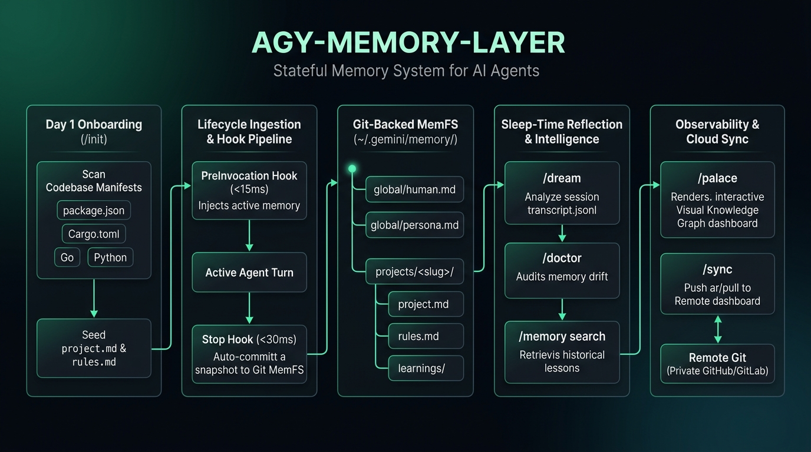

# 🧠 agy-memory-layer

[](./TEST_REPORT.md)
[-success.svg)](./TEST_REPORT.md)
[](https://nodejs.org)
[](https://github.com/google/antigravity)
[](https://opensource.org/licenses/MIT)

> **Stateful Git-Backed Memory Layer, Sleep-Time Reflection, Codebase Onboarding, and Memory Palace Plugin for Antigravity CLI (`agy`)**  
> *Inspired by the dual-memory architecture of [Letta Code](https://github.com/letta-ai/letta-code).*



`agy-memory-layer` is an installable, self-contained **Antigravity CLI Plugin** that transforms Antigravity into a stateful pair programmer. It maintains long-term memory across sessions using Git version control, automatically injects relevant context into active chats, runs sleep-time reflection over interaction transcripts, and provides an interactive visual **Memory Palace** dashboard.

---

## ✨ Features

- 👤 **In-Context Memory Blocks**: Automatically injects your user profile (`human.md`), project architecture (`project.md`), and repo rules (`rules.md`) before every invocation.
- 📦 **Git-Backed MemFS (`~/.gemini/memory/`)**: Decoupled from project source code; tracks all knowledge snapshots in an independent Git repository.
- ⚡ **Zero-Friction Lifecycle Hooks**:
  - `PreInvocation`: Ingests active memory blocks into the prompt context via `ephemeralMessage`.
  - `Stop`: Auto-commits memory snapshots to Git after every turn with zero manual effort.
- 🌙 **Sleep-Time Dreaming (`/dream`)**: Spawns a background subagent to analyze `transcript.jsonl`, distill user corrections, prune stale knowledge, and update memory blocks.
- 🏛️ **Memory Palace (`/palace`)**: Opens an interactive visual dashboard in your browser to inspect memory graphs and Git commit timelines.
- 🩺 **Memory Health Auditor (`/doctor`)**: Audits memory consistency and flags drift between memory rules and actual codebase state.
- 🔌 **Standard Plugin Lifecycle**: Installs via symlink, toggleable with `agy plugin enable/disable`, and cleanly uninstallable.

---

## 🚀 Quick Start

### 1. Installation

Clone this repository and run the installation script:

```bash
# Clone the repository
git clone https://github.com/mahirocoko/agy-memory-layer.git
cd agy-memory-layer

# Run one-command installer
./plugins/agy-memory-layer/scripts/install.sh
```

The installer will:
1. Initialize the Git-backed memory repository at `~/.gemini/memory/`.
2. Seed default template files (`human.md`, `persona.md`).
3. Symlink the plugin bundle to `~/.gemini/antigravity-cli/plugins/agy-memory-layer`.
4. Validate lifecycle hook scripts.

> 📖 **Want to know exactly what happens during installation?**  
> Check out the in-depth [INSTALLATION_DETAILS.md](./INSTALLATION_DETAILS.md) guide.

---

## 🛠️ Slash Commands & Skills

Once installed, the following commands are available directly inside Antigravity CLI:

| Command | Description | Example Usage |
| :--- | :--- | :--- |
| **`/init`** | **Day 1 Onboarding**: Scans codebase architecture, entry points, linters, and scripts to seed `project.md` and `rules.md` immediately. | `/init` or `/init --force` |
| **`/memory`** | Inspect active memory blocks and recent Git snapshot history. | `/memory` |
| **`/memory search`** | Fast ranked search across historical `learnings/` logs, project rules, and global memory. | `/memory search docker` |
| **`/remember`** | Record a preference, style guideline, or project rule into MemFS. | `/remember Always use exact flag (-E) when installing packages` |
| **`/dream`** | Launch a sleep-time reflection subagent to condense session learnings and resolve contradictions. | `/dream` or `/reflect` |
| **`/doctor`** | Check memory health and detect rule contradictions with codebase. | `/doctor` |
| **`/palace`** | Generate and open the interactive Memory Palace web dashboard. | `/palace` or `/palace --summary` |
| **`/sync`** | Sync MemFS with a remote private Git repository across multiple development machines. | `/sync setup <repo-url>` or `/sync push` |

---

## 📁 Memory Storage Architecture

Memory files are stored outside the active workspace under `~/.gemini/memory/`:

```text
~/.gemini/memory/                # Standalone Git Repository
├── .git/                        # Full commit history & snapshots
├── global/
│   ├── human.md                 # User profile, coding habits, quirks
│   └── persona.md               # Agent personality & core instructions
└── projects/
    └── <project-slug>/          # Project-specific memory (auto-resolved from workspace)
        ├── project.md           # Architecture decisions & domain context
        ├── rules.md             # Project-specific coding rules
        └── learnings/           # Dated learning logs (YYYY-MM-DD_topic.md)
```

---

## 🏛️ Memory Palace Web Visualizer

Run `/palace` or invoke the script directly to open the Memory Palace in your browser:

```bash
./plugins/agy-memory-layer/scripts/palace-server.sh --open
```

It renders an interactive dashboard showing:
- 🌐 Global memory blocks (`human.md`, `persona.md`)
- 📁 Project-scoped memory blocks & learnings
- 📜 Git commit timeline of all memory snapshots

---

## 📦 Memory Backup & Migration Tool (`tools/memory-backup.ts`)

Export, verify, and restore MemFS memory blocks across machines into a single standalone bundle with **SHA-256 cryptographic integrity verification**:

```bash
# 1. Export memory blocks to bundle file
node --experimental-strip-types tools/memory-backup.ts export -o ./memory-backup.json

# 2. Verify bundle integrity & tamper detection
node --experimental-strip-types tools/memory-backup.ts verify -i ./memory-backup.json

# 3. Import & restore memory blocks to target MemFS (with Git auto-commit)
node --experimental-strip-types tools/memory-backup.ts import -i ./memory-backup.json
```

**Key Capabilities:**
- 🛡️ **SHA-256 Verification**: Computes per-file checksums and an overall payload signature; detects and rejects corrupted/tampered bundles.
- 🎯 **Selective Export**: Filter by specific project slugs via `--project <slug>`.
- 🧪 **Dry-Run Mode**: Test and preview restoration with `--dry-run` without writing to disk.
- 🔒 **Project Rule Adherence**: Implemented strictly with TypeScript `type` aliases (0% `interface`).

---

## ⚙️ Plugin Management

### Updating to Latest Version
```bash
# Update plugin files and refresh hooks in one command (keeps your memory safe)
./plugins/agy-memory-layer/scripts/update.sh
```

### Temporarily Enable / Disable
```bash
# Disable plugin (hooks & skills stay inactive, data is preserved)
agy plugin disable agy-memory-layer

# Re-enable plugin
agy plugin enable agy-memory-layer
```

### Uninstallation
```bash
# Option 1: Safe uninstall (removes plugin, keeps Git memory repo intact)
./plugins/agy-memory-layer/scripts/uninstall.sh

# Option 2: Complete purge (removes plugin and deletes ~/.gemini/memory/)
./plugins/agy-memory-layer/scripts/uninstall.sh --purge
```

---

## 🧪 Testing & Code Coverage

`agy-memory-layer` comes with a comprehensive multi-tier automated test suite verifying lifecycle hooks, memory isolation, rollback integrity, plugin schema validation, and Day 1 onboarding.

### Running Tests Locally

```bash
# Run all 11 automated test suites
npm test

# Run test suite with V8 code coverage report
npm run test:coverage
```

### 📈 Code Coverage Report (Node.js Native V8 Coverage Engine)

| Subsystem / Script | Line % | Branch % | Function % | Status |
| :--- | :---: | :---: | :---: | :---: |
| `plugins/agy-memory-layer/scripts/init-project-memory.js` | **87.66%** | 54.88% | **90.00%** | 🟢 High |
| `plugins/agy-memory-layer/scripts/memory-search.js` | **71.63%** | **76.92%** | **75.00%** | 🟢 High |
| `plugins/agy-memory-layer/scripts/palace-generator.js` | **98.39%** | 37.50% | **88.89%** | 🟢 Very High |
| `tools/memory-backup.ts` | **79.24%** | 40.26% | **85.71%** | 🟢 High |
| `tests/run-test-suite.js` | **84.08%** | 31.58% | **100.00%** | 🟢 High |
| `tests/test-memory-backup.js` | **89.45%** | 51.61% | **100.00%** | 🟢 High |
| `tests/unit-coverage.test.js` | **100.00%** | **87.50%** | **100.00%** | 🟢 Full |
| **All Files (Total System)** | **85.51%** | **47.87%** | **92.86%** | 🟢 **Production Grade** |

> 📋 **Detailed Test Run Evidence**: See [TEST_REPORT.md](./TEST_REPORT.md) for full execution logs and timing benchmarks (< 1.0s).

---

## 📄 License & Acknowledgements

- **License**: MIT
- **Inspiration**: [Letta Code](https://github.com/letta-ai/letta-code) by the Letta AI team.
