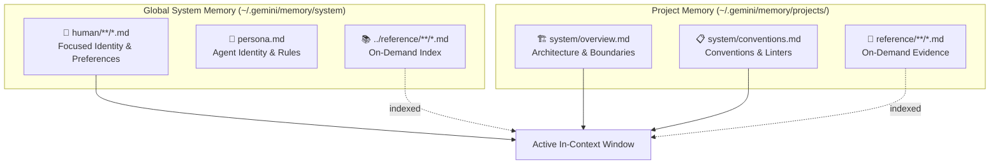

# /palace - Memory Palace Visualizer

Visual dashboard and mind-map explorer for the agent's MemFS memory blocks and Git commit history.

## Modes

1. **Browser Visualizer Mode**:
   Generates a rich, interactive HTML dashboard and opens it in your default web browser.
   ```bash
   WORKSPACE_DIR="$(pwd)"
   SCRIPT_DIR="$(dirname "$(realpath "${BASH_SOURCE[0]}")")/../../scripts"
   bash "$SCRIPT_DIR/palace-server.sh" "$WORKSPACE_DIR" --open
   ```

2. **In-Chat Artifact Mode**:
   When viewing within the terminal or chat interface, render a structured Markdown Artifact containing:
   - 🗺️ **Mermaid Graph**: Connections between focused system owners, on-demand references, and the current project.
   - 📋 **Memory Blocks Table**: Key summaries of each active memory file.
   - 📜 **Git Timeline**: Recent snapshot history.

## Mermaid Graph Template for Chat Artifacts



## Quick Commands
- `/palace` — Open the visual Memory Palace dashboard in browser.
- `/palace --summary` — Show in-chat memory graph artifact.
